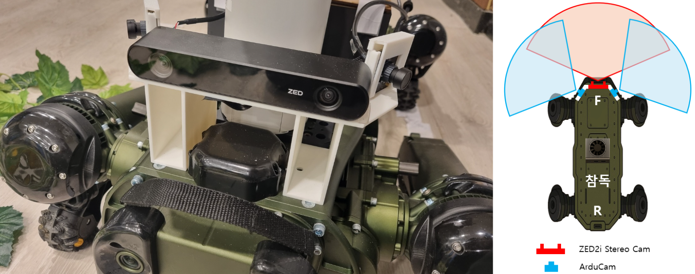

# MCVS: Multi-Camera Vision System for ChamDog

> ⚠️ **Notice (임시 안내)**<br>
> 본 레포지토리는 기존 ChamDog 로봇 개발 프로젝트에서 제가 담당했던 **Vision System** 파트의 코드를 그대로 가져온 것입니다. 논문 실험용으로 코드를 활용하기 위해 수정이 필요한 부분이 많아 별도의 레포지토리로 분리하게 되었습니다.<br>
> 현재 아무런 수정 작업이 진행되지 않은 상태이며, 앞으로 실험 요구사항에 맞춰 코드를 변경할 예정입니다.<br>
> **본 레포지토리의 코드를 그대로 사용하실 경우 주의가 필요합니다.**

---


<p align="center">
  
  <br>
  <em>▲ 전체 요약도는 프로젝트의 통일감을 위해서 승운님께서 잘 만들어주신 그림을 사용했습니다.</em>
</p>

본 저장소는 <strong>참외 수확 로봇(참독) 프로젝트</strong>의 서브시스템인 <strong>비전 인식 시스템 (Vision Perception System)</strong>의 코드만을 다루고 있습니다.  
3대의 카메라(ZED, Arducam x2)를 활용하여 주행 경로(파이프)를 탐지하고, 딥러닝 기반으로 참외를 실시간으로 추적하여 수확 가능 여부를 판단합니다.

---

## 1. Project Overview (프로젝트 개요)

본 프로젝트의 목표는 비정형적인 온실 환경에서 자율 주행하며 참외를 인식하고 수확하는 로봇 시스템을 구축하는 것입니다. 그중 <strong>비전 인식 시스템(Vision Perception System)</strong>은 로봇의 안정적인 주행과 정밀한 수확 제어에 필수적인 시각 정보를 수집 및 분석하여, 로봇이 복합적인 임무를 수행하는 데 필요한 핵심 데이터를 제공합니다.

* **Navigation**: 전방 스테레오 카메라(ZED)를 통해 주행 경로(파이프 라인)를 실시간으로 검출하고, 로봇의 조향각(Steering Angle)을 계산하여 안정적인 자율 주행을 지원합니다.
* **Recognition**: 측면 카메라(Arducam)를 활용하여 수확 대상인 성숙한 참외 객체를 딥러닝 모델로 탐지(Detection)하고, 연속적인 영상 프레임 내에서 개별 객체를 추적(Tracking)합니다.
* **Decision Making**: 다중 카메라로부터 수집된 주행 정보와 객체 인식 정보를 종합적으로 분석하여, 주행 모드 전환(Go/Stop) 및 수확 작업 시점(Harvest Mode) 결정 등 로봇의 전체적인 행동을 제어하는 의사결정을 수행합니다.

---

## 2. System Architecture (시스템 구성)

### Hardware Setup
시스템은 <strong>NVIDIA Jetson AGX Orin</strong> 임베디드 보드에서 구동되며, 총 3대의 카메라 센서를 사용합니다.

* **Main Controller**: NVIDIA Jetson AGX Orin
* **Front Camera**: StereoLabs ZED 2i (주행 경로 인식용)
* **Side Cameras**: Arducam USB Camera x2 (Left/Right, 작물 인식용)

<p align="center">
  
  <br>
  <em>Figure. Hardware Configuration & Field of View (FOV)</em>
</p>

### Software Stack
* **Programming Language**: Python 3.8+
* **Deep Learning Inference**: Ultralytics YOLO11 (Accelerated with **TensorRT** for Edge Computing)
* **Computer Vision**: OpenCV (Used for Image Pre-processing & Lane Detection)
* **Object Tracking**: ByteTrack (Real-time Multi-Object Tracking)
* **Concurrency Control**: Python `threading` (Asynchronous Producer-Consumer Architecture)

---

## 3. Key Features (주요 기능)

1.  **Multi-Camera Synchronization (프레임 동기화)**
    * 서로 다른 FPS와 Latency를 가진 3대 카메라의 프레임을 OS 커널 드라이버 수준의 타임스탬프를 기준으로 정밀하게 동기화(`FrameSynchronizer`)하여 처리

2.  **Hybrid Perception (하이브리드 인식)**
    * **Pipe Detection**: 전통적인 CV 알고리즘(Hough Transform, ROI Filtering)을 사용하여 빠르고 강건하게 주행 경로를 탐지 `made by SU`
    * **Chamoe Tracking**: TensorRT로 가속화된 YOLO 모델과 ByteTrack 알고리즘을 결합하여, 개별 참외 객체의 ID를 유지하고 연속적인 위치 변화를 추적

3.  **Robust Stability (안정성 확보)**
    * **Resource Management**: Producer-Consumer 패턴의 멀티스레딩 구조를 통해 추론(Inference) 지연 시에도 카메라 입력 버퍼를 최신 상태로 유지
    * **Asynchronous Parallel Processing**: CPU 중심의 파이프 탐지와 GPU 중심의 객체 인식을 비동기적으로 병렬 처리(`ThreadPoolExecutor`)하여 시스템 자원 활용률을 극대화
  
4.  **Robust Data Interface (데이터 인터페이스 및 연동)**
    * **Blackboard Architecture**: Behavior Tree 기반 제어 시스템과의 연동을 위해 표준화된 데이터 구조(`VisionPerception`, `MissionStatus` 등)를 정의하고 공유
    * **IPC Dashboard**: TCP 소켓 통신 기반의 모니터링 클라이언트(`monitor_client.py`)를 통해, 로봇 내부의 Blackboard 데이터 갱신 상태를 실시간으로 검증 가능

5.  **Real-time Web Streaming & Debugging (웹 스트리밍 및 디버깅)**
    * **Multi-View Streaming**: 기존의 로컬 파일 저장 방식 대신, 경량화된 MJPEG 웹 서버(`stream_server.py`)를 구현하여 외부 기기에서 실시간으로 3분할(Left/Pipe/Right) 병합 화면 확인 가능
    * **Remote Access**: `0.0.0.0` 호스트 바인딩을 통해 동일 네트워크 내의 모든 디바이스에서 로봇의 시각 정보에 접근 가능

---

## 4. Directory Structure (디렉토리 구조)

본 프로젝트는 모델 학습 실험을 위한 환경과, 실제 로봇(Jetson AGX Orin)에 탑재되어 구동되는 런타임 패키지로 구성되어 있습니다. 특히 **`mcvs`** 패키지는 제어 시스템과의 연동을 위해 **Blackboard 아키텍처**를 기반으로 구조화되었습니다.

### 4.1. Overall Repository Layout (전체 구조)
```text
MCVS_for_ChamDog/
├── mcvs_for_chamdog/        # ChamDog 비전 통합 프로젝트 폴더
│   ├── mcvs/                # [Runtime] 비전 시스템 메인 패키지        
│   ├── common/              # [Shared]  Blackboard 데이터 구조 (Mission/Vision/Robot)
│   │── monitor_client.py    # [Tool]    실시간 Blackboard 데이터 모니터링 클라이언트 (CLI Dashboard)
│   └── lab/                 # [Lab]     실험 및 연구 개발 공간
│      ├── build_test/       #   ├─ TensorRT 변환 및 최적화 빌드 테스트
│      ├── cam_test/         #   ├─ 카메라 하드웨어 연결 및 디버깅
│      ├── dataset/          #   ├─ 모델 학습 및 실험용 데이터셋 (Ignored)
│      ├── model_training/   #   ├─ YOLO 모델 학습 및 실험 (Notebooks)
│      └── tools/            #   └─ 데이터셋 분석 및 개발 보조 도구
├── assets/                  # 문서화 리소스 (이미지 및 다이어그램)
├── README.md                # 프로젝트 메인 문서
├── requirements.txt         # 의존성 패키지 목록 (생성 예정)
└── LICENSE
```

### 4.2. Core Vision Pipeline (`mcvs`)
핵심 비전 시스템은 기능별로 모듈화되어 있으며, 외부 통신 및 제어 연동을 위한 서버 기능을 포함합니다.

```text
mcvs/
├── common/                    # [Integration]
│   └── blackboard.py          #   └─ Vision, Mission, Robot 모듈 간 상태 공유 메모리 (Blackboard)
├── core/                      # [System Core]
│   ├── camera_manager.py      #   ├─ 멀티 스레드 카메라 제어 (Producer)
│   ├── synchronizer.py        #   ├─ 다중 카메라 프레임 동기화 (Sync Logic)
│   └── data_types.py          #   └─ 내부 데이터 처리를 위한 Dataclass 정의
├── modules/                   # [Algorithms]
│   ├── detector.py            #   ├─ YOLOv11 객체 탐지 및 추적 인터페이스
│   └── pipe_tracker.py        #   └─ 주행 경로(파이프) 탐지 알고리즘
├── utils/                     # [Utilities]
│   ├── config.py              #   ├─ 시스템 파라미터 및 하드웨어 설정
│   ├── file_io.py             #   ├─ 영상 녹화(Combined View) 및 로그 저장
│   ├── visualizer.py          #   ├─ 실시간 시각화 (Overlay, ROI, Status)
│   ├── stream_server.py       #   ├─ [Net] 웹 모니터링용 MJPEG 스트리밍 서버
│   ├── ipc_server.py          #   ├─ [Net] 대시보드 연동용 TCP 소켓 서버
│   └── stats_collector.py     #   └─ 시스템 성능(FPS, Sync Rate) 통계 수집
├── weights/                   # [Model] 최적화된 모델 엔진 파일 (.engine)
├── output/                    # [Result] 결과 저장소 (Logs, Videos)
└── main.py                    # [Entry] 비전 시스템 메인 실행 파일
```

---

## 5. Installation & Setup (설치 및 실행)

> **⚠️ Note**: 상세한 가상환경 구축 및 의존성 패키지 설치 가이드는 추후 필요에 따라 업데이트될 예정입니다.  
> 현재는 환경 설정이 완료된 연구실 테스트 장비를 기준으로 실행 방법을 안내합니다.

### Quick Start (Internal Use)

<strong>후문 연구실 Orin</strong> 장비에 `cv_test` 계정으로 접속했다면, 별도의 설정 없이 아래 명령어로 즉시 시스템을 구동할 수 있습니다.

```bash
# 1. 가상환경 활성화 (yolo_env)
source ~/yolo_env/bin/activate

# 2. 실행 경로로 이동
# (Repository Root인 'MCVS_for_ChamDog'에 위치한다고 가정)
cd mcvs_for_chamdog/mcvs

# 3. 메인 프로그램 실행
python main.py
```

---

## 6. Discussion & Roadmap (논의 사항 및 향후 계획)
현재 시점(25.11.25)의 코드를 기점으로 Vision System의 필수 기능 구현은 완료되었다고 판단됩니다. 향후 개발 단계에서는 <strong>보행 및 수확 제어 시스템과의 실질적인 통합(Integration)</strong>을 목표로 삼아서 연구실 내부에서 논의된 방향성에 따라 다음과 같은 로드맵으로 개발을 진행할 예정입니다.

### 6.1. System Integration (제어 시스템 연동)
현지님 및 승운님과의 논의 결과, 시스템 간 데이터 공유 및 제어 흐름 관리를 위해 <strong>Behavior Tree</strong> 아키텍처를 도입하기로 결정했습니다.

* **Data Interface Definition**: 비전 시스템에서 산출되는 결과(객체 위치, 수확 모드, 주행 경로 등)를 Behavior Tree의 <strong>Blackboard</strong>에 적재할 수 있도록 데이터 구조를 표준화할 예정
* **Centralized Control Logic**: 개별 모듈의 상태를 종합적으로 모니터링하고, 보행-인식-수확 간의 유기적인 작업 전환을 판단하는 상위 제어 로직(Decision Layer)을 구현할 계획

### 6.2. Model Enhancement (인식 모델 성능 고도화)
현재 논문 작성을 위한 실험의 일환으로 Detection 및 Tracking 모델의 고도화 작업을 병행할 예정입니다.

* **Branch Strategy**: 실험적인 모델 변경 사항은 메인 코드베이스의 안정성을 해치지 않도록 별도의 브랜치(`for_paper`)에서 독립적으로 수행
* **Future Merge**: 추후 실험을 통해 검증된 강건한 모델(Robust Model)이나 성능 개선 사항이 있을 경우, 메인 브랜치로의 통합(Merge)을 고려할 예정

### ✅ Future To-Do List

- [x] **Behavior Tree Architecture Study**
    - 제어 시스템 연동을 위한 Blackboard 데이터 구조(`common/blackboard.py`) 정의 완료
    - IPC 통신을 통한 실시간 데이터 모니터링 환경 구축 완료
- [ ] **Global State Manager Implementation**
    - 전체 센서 데이터를 기반으로 로봇의 다음 행동을 결정하는 종합 제어 노드 구현
- [ ] **Model Optimization & Advanced Training**
    - 학습 데이터셋 확장 및 다양한 SOTA 모델 적용 실험
    - *(Note: 본 작업은 실험용 브랜치에서 별도로 진행할 예정)*

---

## 👨‍💻 Maintainers & Contributors

> _Vision System과 관련하여 추가적인 기능 구현이나 논의 사항이 있다면 언제든 말씀해 주세요. by 도현_
* **Dohyeon Lee** ([@editdiary](https://github.com/editdiary))